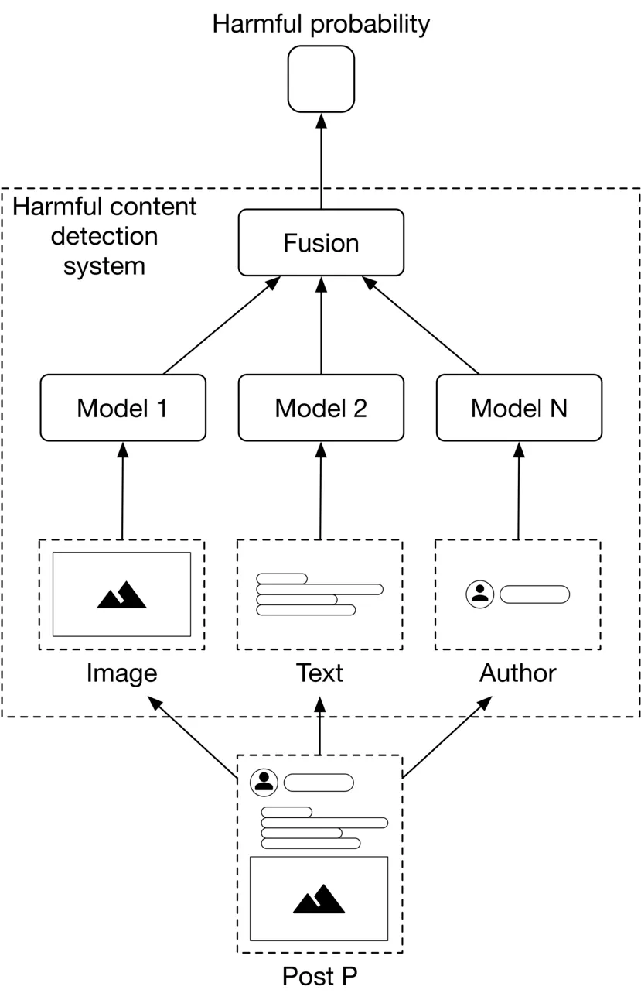
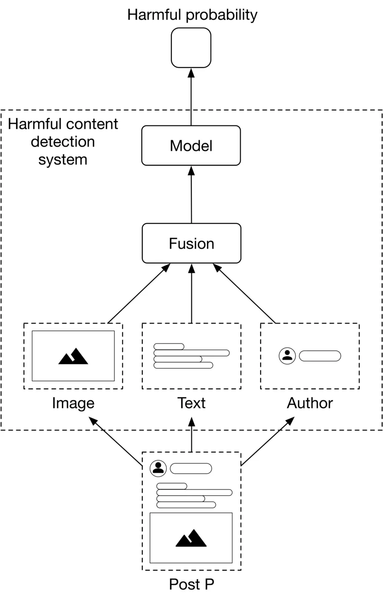

# Context

There are 2 categories:
1. Harmful Content: Posts
2. Bad Actors: Fake accounts, phising content, spam content

**Goal:** To design a system that focuses on
- Monitor new posts
- Detect harmful content
- Removes/demote them according to policies/guidelines

# Clarifying Questions

- Does the system detect both harmful content and bad actors?
- Should a post only contain text, or are images and videos allowed?
- Which specific categories of harmful content are we looking to identify?
- Are there any human annotators available to label posts manually?
- Can I assume the system has a feature for users to report harmful content?
- Should we explain why a post is deemed harmful and removed?
- What is the system's latency requirement? Do we need real-time prediction, or can we rely on batch prediction?

# Frame the Problem

## ML Objective
 Predict/Classify accurately harmful posts for removal

## Model Input/Output
- **Input**: Posts: Potentially multimodal (Image/Video, Text, User Account)
- **Output**: Porbability that the post is harmful

# ML Architecture

## Late Fusion vs Early Fusion

ML models process different modalities independently, then combine their predictions to make a final prediction.

**Advantages:** 
- We can train, evaluate, and improve each model independently.
**Disadvantages:**
- Requires separate training data for each modality, which can be time-consuming and expensive.
- Combination of modalities might be harmful, especially with memes (text + image has a new meaning)

Modalities are combined first into a fused feature, then the model makes a prediction.

**Advantages:**
- No need for separate training data for each modality; only one model needs training data.
- Model considers all modalities, potentially capturing harmful combinations.
**Disadvantages:** 
- Learning task is more difficult due to complex relationships between modalities, especially without sufficient training data.

Method to use is **EARLY FUSION** as it is more accurate in the event each modality is not harmful on its own, and large user base/posts hence no issue with data.

## Classifier to Use
1. Binary Classifier
   - Takes fused feature as input, predicts probablity harmful
     - Does not provide clue/hint which class of harm it belongs to, to inform user
     - Unable to improve sytem based on underperforming types of hamrful content
2. Binary Classifier for each harmful class
   - Each class has its own model, all takes the fused feature as input
     - Drawback is multiple model needs own maintanence and trianing
     - Time consuming and expensive
3. Multi-class Classifier
   - Takes fused feature as input, predicts probability of each harmful class
     - However each class might actually require the features to be transformed/fitted differently, not good to use a single generalized model
4. Mult-task/headed Classifier