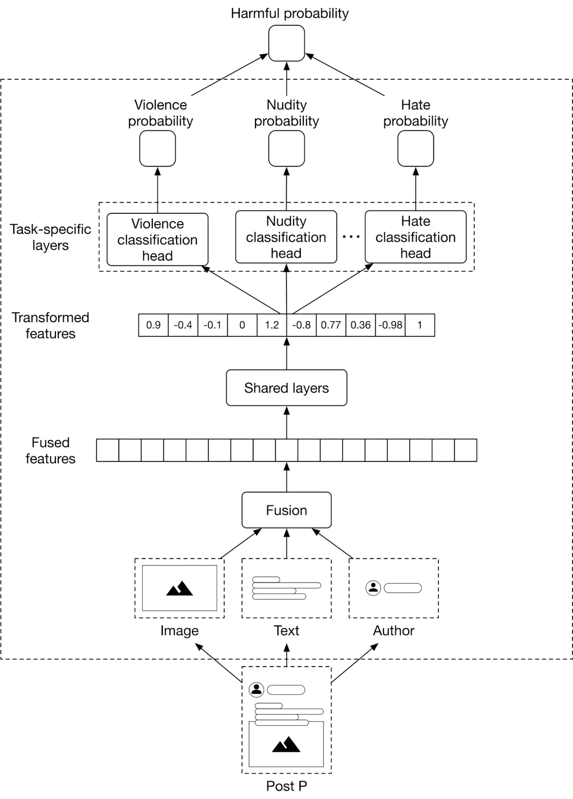
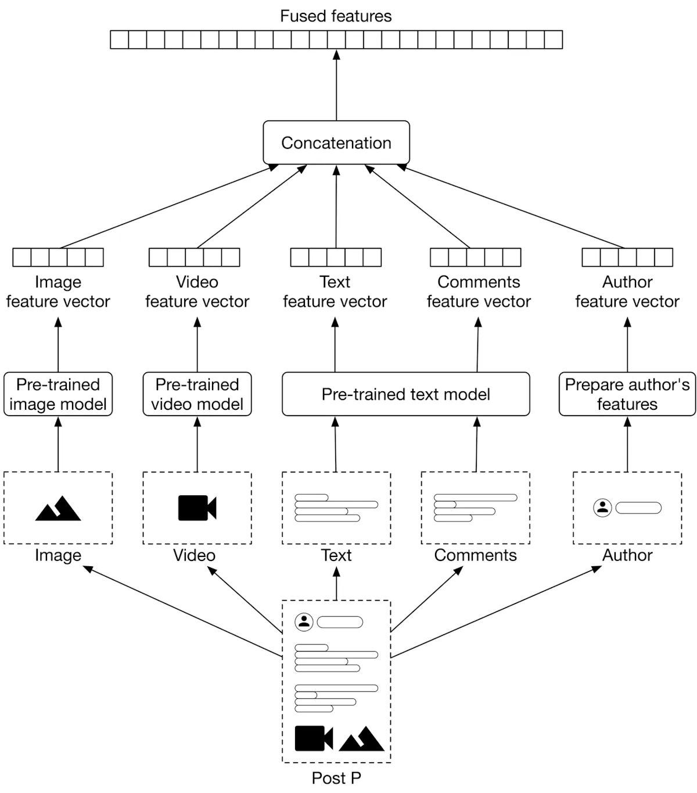
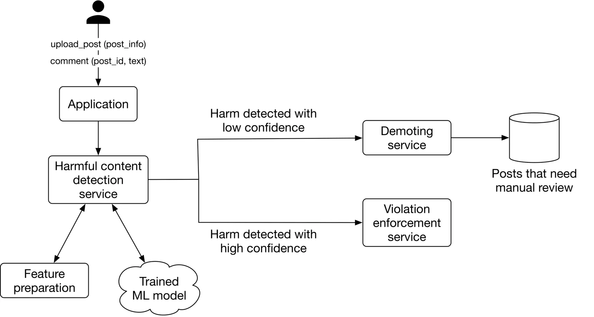

# Table of Contents

- Clarifying Questions
- Frame the Problem
   -   ML Objective
   -    Model Input/Output
- ML Architecture
  - Late Fusion vs Early Fusion
  - Classifier to Use
  - Final System Architecture
- Data Pipeline
  - Data Avaliable
  - Feature Engineering
- Model Development
- Model Serving
  - Steps in MLOps

# Context

There are 2 categories:
1. Harmful Content: Posts
2. Bad Actors: Fake accounts, phising content, spam content

**Goal:** To design a system that focuses on
- Monitor new posts
- Detect harmful content
- Removes/demote them according to policies/guidelines

# Clarifying Questions

- Does the system detect both harmful content and bad actors?
- Should a post only contain text, or are images and videos allowed?
- Which specific categories of harmful content are we looking to identify?
- Are there any human annotators available to label posts manually?
- Can I assume the system has a feature for users to report harmful content?
- Should we explain why a post is deemed harmful and removed?
- What is the system's latency requirement? Do we need real-time prediction, or can we rely on batch prediction?

# Frame the Problem

## ML Objective
 Predict/Classify accurately harmful posts for removal

## Model Input/Output
- **Input**: Posts: Potentially multimodal (Image/Video, Text, User Account)
- **Output**: Porbability that the post is harmful

# ML Architecture

## Late Fusion vs Early Fusion

ML models process different modalities independently, then combine their predictions to make a final prediction.

**Advantages:** 
- We can train, evaluate, and improve each model independently.
**Disadvantages:**
- Requires separate training data for each modality, which can be time-consuming and expensive.
- Combination of modalities might be harmful, especially with memes (text + image has a new meaning)

Modalities are combined first into a fused feature, then the model makes a prediction.

**Advantages:**
- No need for separate training data for each modality; only one model needs training data.
- Model considers all modalities, potentially capturing harmful combinations.
**Disadvantages:** 
- Learning task is more difficult due to complex relationships between modalities, especially without sufficient training data.

Method to use is **EARLY FUSION** as it is more accurate in the event each modality is not harmful on its own, and large user base/posts hence no issue with data.

## Classifier to Use
1. Binary Classifier
   - Takes fused feature as input, predicts probablity harmful
     - Does not provide clue/hint which class of harm it belongs to, to inform user
     - Unable to improve sytem based on underperforming types of hamrful content
2. Binary Classifier for each harmful class
   - Each class has its own model, all takes the fused feature as input
     - Drawback is multiple model needs own maintanence and trianing
     - Time consuming and expensive
3. Multi-class Classifier
   - Takes fused feature as input, predicts probability of each harmful class
     - However each class might actually require the features to be transformed/fitted differently, not good to use a single generalized model
4. **Multi-Headed Classifier**
    - Single model learns different tasks simultaneously
    - Balance between training and efficiency

## Final System Architecture

# Data Pipeline

## Data Avaliable

1. User Data Schema
   - Using TikTok account as an example:

| User ID | Username | Following | Followers | Likes | Description |
| ------- | -------- | --------- | --------- | ----- | ----------- |
| ...     | ...      | ...       | ...       | ...   | ...         |

1. Post Data

| Post ID | Author ID | Timestamp | Description | Video | Likes | Number Comments | Number Saves |
| ------- | --------- | --------- | ----------- | ----- | ----- | --------------- | ------------ |
| ...     | ...       | ...       | ...         | ...   | ...   | ...             | ...          |

3. User-post Interaction Data

  | User ID | Post ID | Interaction type | Interaction value  | Timestamp  |
  | ------- | ------- | ---------------- | ------------------ | ---------- |
  | 4       | 20      | Like             | -                  | 1658451341 |
  | 11      | 7       | Comment          | This is disgusting | 1658451365 |

## Feature Engineering

**Post Features**

1. Textual Content:
   - Comments, DEscription etc
   - Vectorization: Embedding Models
     - Better than statistical models like TF-IDF or Bag of Words, which does not capture semantic meanings
2. Image/Video Content:
   - Convert unstructured data into a feature vector.
   - For images, options include pre-trained models like CLIP's visual encoder
     - Component of the CLIP (Contrastive Language-Image Pre-training) model developed by OpenAI
   - For videos, models such as VideoMoCo could be effective.
     - Self-supervised learning framework introduced by researchers at Facebook AI Research (FAIR) for learning representations from images without human annotations
3. Numerical Content:
   - Number of likes etc, scale them

**Author Features**

1. Author's violation history
   - Number of violations
   - Total user reports
2. Author's demographics
   - Age
   - Gender, etc
3. Number of followers etc

# Model Development

## Model Selection:
- Neural networks are commonly used for multi-task learning.
  - MBMT-Net
- Hyperparameter tuning, often done via grid search, is crucial for finding optimal hyperparameter values.
  - Optuna

## Model Training:
### Constructing the Dataset:
- Dataset comprises inputs (features) and outputs (labels).
- Features are computed offline in batches, while labels can be obtained through hand labeling or natural labeling.
- Hand labeling is accurate but expensive, while natural labeling is quicker but produces noisier labels.

### Choosing the Loss Function:
- For binary classification tasks, standard loss functions like cross-entropy are commonly used.
- Overall loss is computed by combining task-specific losses.

## Challenges and Techniques:
- Overfitting is a common challenge in training multimodal systems.
- Techniques to address overfitting include gradient blending and focal loss.

# Model Evaluation

## Offline
- ROC Curve:
  - ROC curves plot the true positive rate (TPR) against the false positive rate (FPR) at various classification thresholds.
  - AUC (Area Under the Curve) summarizes the ROC curve into a single value, indicating the model's ability to distinguish between classes.
  - ROC curves are less sensitive to class imbalance but may not be ideal for imbalanced datasets or multi-label classification tasks.

- Precision-Recall Curve:
  - Precision-recall curves plot precision against recall at various classification thresholds.
  - AUC-PR (Area Under the Precision-Recall curve) summarizes the precision-recall curve into a single value, indicating the model's ability to prioritize true positives while minimizing false positives.

## Online
1. **Prevalence**:
   - Prevalence measures the ratio of harmful posts that were not prevented to all posts on the platform.
   - Formula: `Prevalence = Number of harmful posts we didn't prevent / Total number of posts on the platform`
   - Shortcoming: It treats all harmful posts equally and does not account for the impact of each post.

2. **Valid Appeals**:
   - Valid appeals represent the percentage of posts initially deemed harmful but later appealed and reversed.
   - Formula: `Valid Appeals = Number of reversed appeals / Number of harmful posts detected by the system`
   - It indicates the effectiveness of the appeals process in correcting false positives.

3. **Proactive Rate**:
   - Proactive rate measures the percentage of harmful posts detected and deleted by the system before users report them.
   - Formula: `Proactive Rate = Number of harmful posts detected by the system / (Number of harmful posts detected by the system + reported by users)`
   - It reflects the system's ability to identify and remove harmful content proactively.

# Model Serving

## Steps in MLOps

1. **Project Structuring and Workflow Management**:
   - **Step**: Organize the machine learning project, manage dependencies, and define modular pipelines.
   - **Tool Suggestions**:
     - Kedro with Poetry
     - More advanced distributed computing like Ray

2. **Experiment Tracking and Model Management**:
   - **Step**: Track experiments, log metrics, parameters, and artifacts during model training and evaluation. Manage model versions and deployments.
   - **Tool Suggestions**:
     - MLflow, Airflow DAG job cycles

3. **Containerization and Deployment**:
   - **Step**: Package models into containers and deploy them to a production environment.
   - **Tool Suggestions**:
     - Openshift Containerization

4. **Continuous Integration and Continuous Deployment (CI/CD)**:
   - **Step**: Automate testing, building, and deployment of machine learning pipelines and models.
   - **Tool Suggestions**:
     - GitLab for CI/CD, or Jenkins

5. **Exposing Model as an Endpoint**:
   - **Step**: Develop APIs to expose machine learning models as endpoints for inference requests.
   - **Tool Suggestions**:
     - Django, FastAPI, Flask

6. **Monitoring and Observability**:
   - **Step**: Monitor pipeline performance, resource utilization, and application health. Visualize metrics and logs to gain insights into the system's behavior.
   - **Tool Suggestions**:
     - Grafana, or tools like Kibana with Logstash
     - **Defining SLOs**:
       - Define Service Level Objectives (SLOs) for key metrics such as latency, throughput, and error rates.
       - Example: Ensure that the average inference latency remains below 100 ms with a 99% confidence level.
     - **Tracking SLOs in Grafana**:
       - Configure Grafana to visualize SLO metrics on dashboards.
       - Use Grafana's alerting feature to set up alerts when SLO thresholds are violated.
